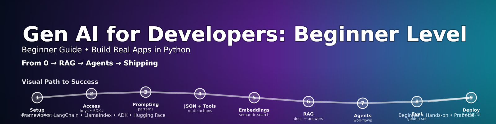

# GenAI Beginner Course (Python) — Build Real Apps

This repository contains a **beginner-friendly course in Generative AI (GenAI)** focused on **application building** (not deep theory and advance).  
You will learn how to **access LLMs**, write reliable prompts, and build practical features like **structured outputs, tools/actions, Retrieval-Augmented Generation (RAG), and agents**.

> If you’re new to GenAI and want to build something real quickly—this course is for you.

---

## What this course is about

You will learn to build GenAI apps using **Python** and modern LLM providers:

- Closed/proprietary LLM APIs: **OpenAI, Azure OpenAI, Google Gemini, Anthropic Claude**
- Open-source model options via **Hugging Face**:
  - Hosted API (fast start; no big downloads)
  - Optional local inference using `transformers`

The course is intentionally **hands-on**:
- short explanations
- lots of labs
- reusable notebooks and starter code

---

## Who should take this course

✅ Good fit if you:
- know basic Python (functions, lists/dicts, installing packages)
- want to build AI features into apps (chat, extraction, summarization, doc QA)
- prefer practical examples over theory-heavy ML

❌ Not the best fit if you want:
- deep transformer math
- training large models from scratch
- advanced ML infrastructure/MLOps from day one

---

## What you’ll build (capstone)

**Internal Knowledge Assistant (RAG + agents/tools)**

By the end, you will have a working app that can:
- ingest documents (txt/pdf)
- create embeddings + vector search
- answer questions using retrieved context
- return answers **with citations**
- optionally run an **agentic workflow** that calls tools (e.g., calculator, file lookup, ticket payload generator)

---

## Course structure

See the full syllabus here: **[`Syllabus.md`](./Syllabus.md)**

High-level flow:
1. **Accessing LLMs** (keys + SDKs + first calls, unified runner)
2. **Prompting patterns** (reliability, constraints, examples)
3. **Structured outputs + tools** (route actions safely)
4. **Embeddings + semantic search**
5. **RAG end-to-end** (doc QA with citations)
6. **Agents & workflows** (multi-step, tool-using apps)
7. **Evaluation + testing** (golden set, regression checks)
8. **Shipping** (FastAPI/Streamlit + security/cost basics)

---

## GenAI frameworks we’ll reference (optional, but included)

You can build everything in this course **without** heavy frameworks (good for beginners).  
However, we include optional sections showing how popular frameworks help you scale:

- **LangChain / LangGraph** (agents, tool calling, RAG building blocks)  
  Docs: https://docs.langchain.com/oss/python/langchain/quickstart
- **LlamaIndex** (RAG + agents “over your data” with strong ingestion tooling)  
  Docs: https://developers.llamaindex.ai/python/framework/
- **Google ADK (Agent Development Kit)** (agent development + orchestration, optimized for Gemini but model-agnostic)  
  Docs: https://google.github.io/adk-docs/

---

## Quickstart (local setup)

### 1) Create and activate a virtual environment

**macOS / Linux**
```bash
python3 -m venv .venv
source .venv/bin/activate
python -V
```

**Windows (PowerShell)**
```powershell
py -m venv .venv
.\.venv\Scripts\Activate.ps1
python -V
```

### 2) Install dependencies

If you have a `requirements.txt`:
```bash
pip install -r requirements.txt
```

Or install the minimum packages used in Lesson 1 notebooks:
```bash
pip install -U openai google-genai anthropic python-dotenv
```

Optional (for local open-source models via Transformers):
```bash
pip install -U transformers torch sentencepiece
```

### 3) Add your API keys

Create a `.env` file (do **not** commit it):

```bash
cp .env.example .env
```

Then fill in at least one provider:

```text
OPENAI_API_KEY="..."
# or GOOGLE_API_KEY="..."
# or ANTHROPIC_API_KEY="..."
# or Azure vars (endpoint/key/deployment)

HF_TOKEN="..."  # Hugging Face token for open models (API path)
```

---

## How to follow the course

Start with the Lesson 1 notebooks in `notebooks/`:

- `01_accessing_llm_part2_api_keys.ipynb` (how to create keys)
- Provider-specific “first call” notebooks:
  - OpenAI
  - Azure OpenAI
  - Google Gemini
  - Anthropic Claude
- Hugging Face open models:
  - hosted API + optional local transformers
- Unified runner notebook:
  - one prompt across all providers (great for demos)

> Tip: In workshops, start with the hosted API paths first (fastest), then add local inference as a bonus.

---

## Security note (important)

API keys are passwords.  
**Never commit secrets** into notebooks or Git.

Recommended:
- environment variables or `.env`
- secret managers (Azure Key Vault / Google Secret Manager / AWS Secrets Manager) for production

---

## Public learning resources (great supplements)

These are publicly accessible and high quality:
- Microsoft **Generative AI for Beginners** (MIT): https://github.com/microsoft/generative-ai-for-beginners
- OpenAI Cookbook (MIT): https://github.com/openai/openai-cookbook
- Hugging Face LLM Course: https://huggingface.co/learn/llm-course/en/chapter1/1
- Full Stack Deep Learning — LLM Bootcamp: https://fullstackdeeplearning.com/llm-bootcamp/

---

## License / reuse

This repo is intended for learning and teaching.  
If you reuse external materials (Microsoft, OpenAI Cookbook, etc.), follow their licenses and attribution requirements.

